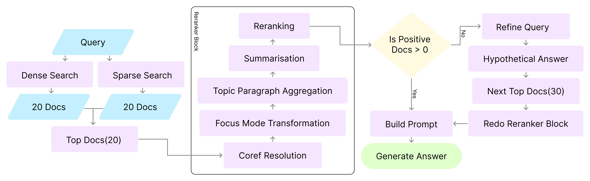
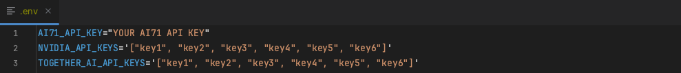

# LiveRAG Challenge: Team NoobRAG

### Team Members:
- Ramy Boulos
- Himanshu Manoj Kaloni
- A F M Mohimenul Joaa

### NoobRAG Implementation FlowChart


- We are using a hybrid retrieval system that combines dense and sparse retrieval methods in a 60:40 ratio, respectively.
- For coreference resolution we are using FastCoref library integrated with SpaCy utilizing the [en_core_web_trf](https://huggingface.co/spacy/en_core_web_trf) as the underlying transformer-based language model. 
- For topic-based paragraph aggregation, we use [BERTopic](https://maartengr.github.io/BERTopic/index.html) with the [all-mpnet-base-v2](https://huggingface.co/sentence-transformers/all-mpnet-base-v2) sentence transformer model for embedding generation.
- For summarization, we are using the [falcon3-10b-instruct](https://huggingface.co/tiiuae/Falcon3-10B-Instruct) from the [AI71](https://platform.ai71.ai/documentation) platform.
- For reranking we are using two different model 
  1. [nv-rerankqa-mistral-4b-v3 from Nvidia(4B params)](https://build.nvidia.com/nvidia/nv-rerankqa-mistral-4b-v3) 
  2. [mxbai-rerank-large-v1 from Mixedbread(435M params)](https://huggingface.co/mixedbread-ai/mxbai-rerank-large-v1)
- For query refinement and hypothetical answer generation, we use the [Mistral-7B-Instruct-v0.3](https://huggingface.co/mistralai/Mistral-7B-Instruct-v0.3) model via the API provided by [Together AI](https://www.together.ai/).

### Resources:
- [LiveRAG Challenge Guidelines](https://liverag.tii.ae/challenge-guidelines.php)
- [HuggingFace Challenge Site](https://huggingface.co/spaces/LiveRAG/Challenge)
- [AI71 Platform](https://platform.ai71.ai/documentation)

### Environment creation:

#### Command to replicate the conda environment
```conda env create -f environment.yml```

#### You can also use pip to install dependencies, after activating your conda environment
```pip install -r requirements.txt```

#### API KEYS
We are using three API
- https://platform.ai71.ai/ for falcon3-10b-instruct inference
- https://www.together.ai/ for Mistral-7B-Instruct-v0.3 inference
- https://build.nvidia.com/ for nv-rerankqa-mistral-4b-v3 inference

We are utilizing `.env` file to keep the keys in the root directory, Like:


### Directory structure

- All part are structured in their own directory following clean architecture pattern.
- Question is read from `data\question\---.jsonl` file 
- Final answer is saved in `data\answer\---.jsonl` file
- Items which need query refinement and more retrieval are saved in `data\refine\---.jsonl` file
- In the `hpc\---.sh` you can find the slurm scripts


### How to run the code

#### 🚀 Batch Processing with GPU Cluster
- **Purpose:** Designed for the **LiveRAG challenge** to generate answers for **500 or more questions**.
- **Requirements:** Requires access to **GPU clusters**.
- **Configuration:** To change the path to the question file, edit **line 275** in `batch_with_gpu_cluster.py`.
- **Execution:** Run the following command in the terminal:
  ```bash
  sbatch hpc/cluster.sh
  ```

#### Batch Processing with Single GPU 
- Suitable for generating answers for up to 100 questions
- Requires a GPU with CUDA support
- Configuration: To update the question file path, modify line 257 in `batch_with_gpu.py`.
- Execution: Run the following command in the terminal: `sbatch hpc/gpu.sh`


#### Single Question Inference with CPU (No Query Refinement)
- Purpose: Used for testing; answers a single question.
- Requirements: Runs on CPU; slow performance expected.
- Execution: Open `single_with_cpu.py` and run the main block manually.
- 

#### Basic RAG System (No Query Refinement or Re-ranking)
- Purpose: Verifies that the basic RAG pipeline is functional.
- Execution: Open basic_rag.py and run the main block manually.

